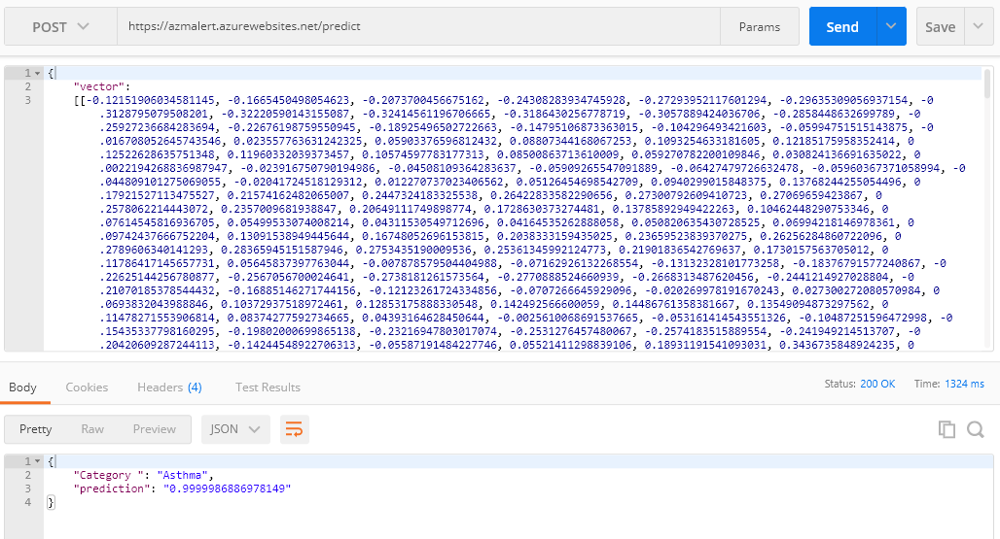

# Flask API

This is the Flask API where we deployed our classification model to predict asthma attacks.
We hosted the API on Azure Cloud Service.

## Link

[API link](https://azmalert.azurewebsites.net/)

### Request example

  Using postman, we can test the prediction function by sending a post request to this [url](https://azmalert.azurewebsites.net/predict).
  The request body must have a vector that contains 1002 float values. (accelerometer sensor values)

